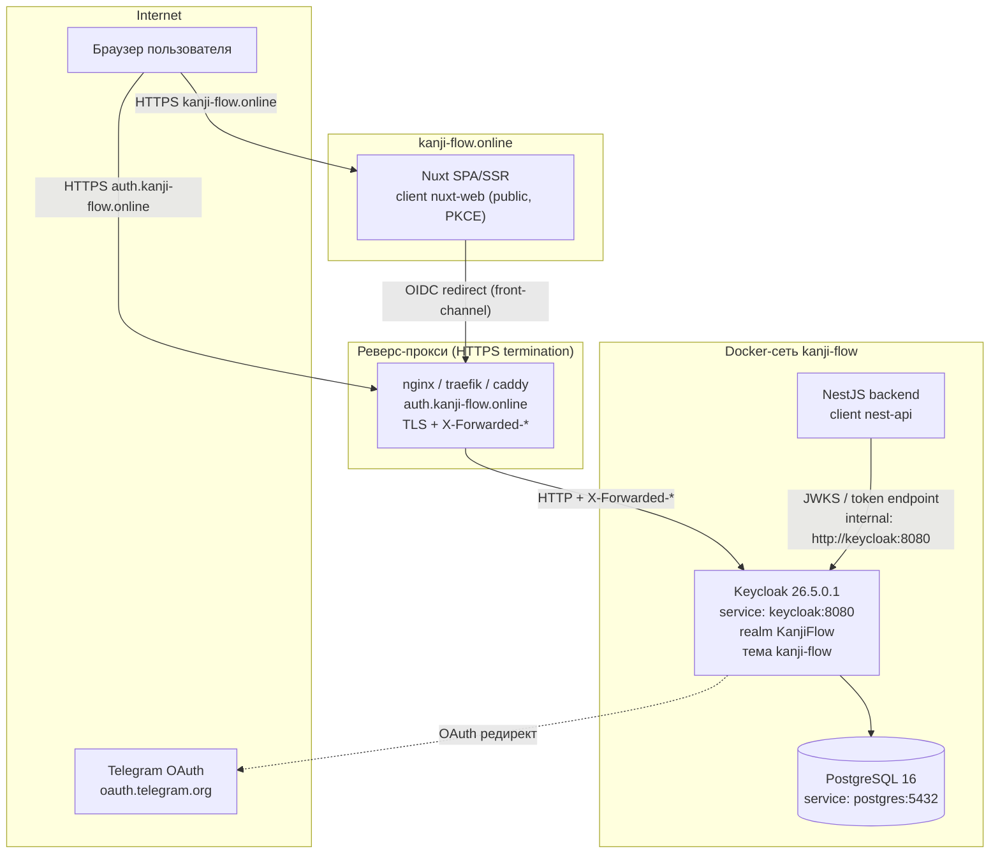
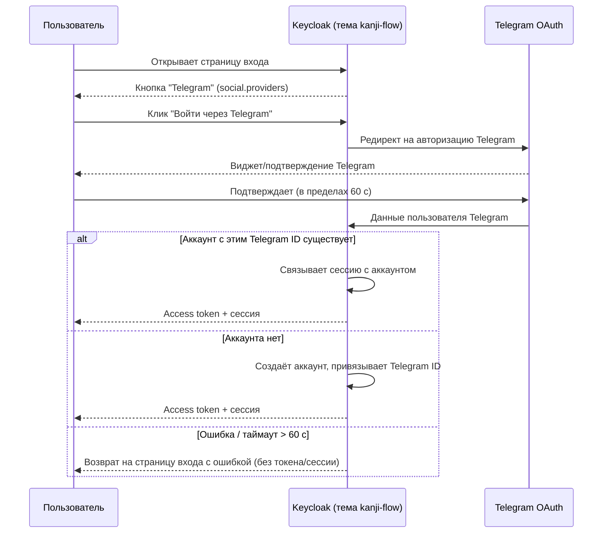
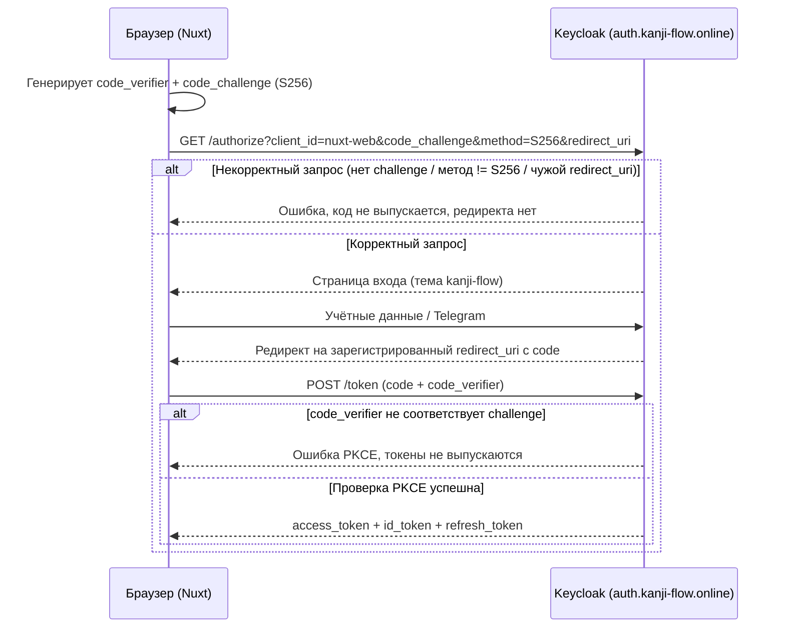

# Design Document

## Overview

Фича превращает инстанс Keycloak (26.5.0.1, русская локализация,
образ `playaru/keycloak-russian`) в единую точку аутентификации экосистемы
Kanji Flow, обслуживаемую на публичном хосте `auth.kanji-flow.online`. Вместо
собственной формы входа в Nuxt-приложении и обработки логина/пароля в NestJS
весь процесс аутентификации переносится в Keycloak с кастомной брендированной
темой `kanji-flow`, воспроизводящей вёрстку эталонной страницы входа фронтенда.

Ключевые принципы дизайна:

- **Декларативность.** Конфигурация realm (клиенты, тема, identity provider,
  политики) хранится в `realm-export.json`; тема и provider-JAR копируются в
  образ через `Dockerfile`; секреты передаются только через переменные
  окружения. (Requirement 9)
- **Разделение ответственности.** Keycloak отвечает за аутентификацию и выпуск
  токенов; `nuxt-web` (public, PKCE S256) делегирует вход через
  Authorization Code Flow; `nest-api` (confidential) только валидирует токены.
  (Requirements 5, 6, 7, 8)
- **Единый бренд.** Тема `kanji-flow` наследует базовую тему `keycloak` и
  переопределяет только шаблоны, стили и сообщения, воспроизводя дизайн на
  утилитарных классах Tailwind CSS (палитра `plum`, тёмная тема) из эталонной
  статики `front_tmp/`. (Requirements 2, 10)

### Соответствие требованиям (карта разделов)

| Раздел дизайна | Требования |
|---|---|
| Architecture → Hostname/Proxy | 1 |
| Components → Тема `kanji-flow` | 2, 10 |
| Components → Стратегия стилизации (Tailwind) | 2.7, 2.8, 10.7, 10.8 |
| Components → Логин/пароль, brute force, reset | 3 |
| Components → Telegram IdP | 4 |
| Components → OIDC `nuxt-web` (PKCE) | 5, 7 |
| Components → Валидация токенов `nest-api` | 6, 8 |
| Data Models → Конфигурация | 9 |
| Correctness Properties + Testing Strategy | 3, 5, 6, 10 (тестируемые) |

### Замечание о переносе домена

Текущая инфраструктура (steering, `.env.example`, `realm-export.json`,
`docker-compose.yml`) ссылается на `keycloak.kanji-flow.online`. Дизайн
предусматривает переход на `auth.kanji-flow.online` как основной хост
аутентификации: обновляются `KC_HOSTNAME`/`KC_HOSTNAME_URL`, конфигурация
реверс-прокси и redirect URI клиентов. Прежний хост может быть оставлен как
редирект на уровне прокси на переходный период, но `KC_HOSTNAME_STRICT=true`
в production допускает единственный канонический хост `auth.kanji-flow.online`.

## Architecture

### Топология развёртывания



Front-channel (браузерные редиректы, страница входа, ссылки в письмах) проходит
через публичный хост `auth.kanji-flow.online`. Back-channel (получение JWKS и
валидация токенов из NestJS) идёт по внутреннему имени Docker-сервиса
`http://keycloak:8080`, минуя публичный хост. (Requirements 1.6, 6.1, 6.2)

### Конфигурация hostname и прокси

Keycloak 26.x использует раздельные опции hostname v2. Значения для production:

| Переменная | Значение (prod) | Назначение | Требование |
|---|---|---|---|
| `KC_HOSTNAME` | `https://auth.kanji-flow.online` | Канонический публичный URL front-channel | 1.1, 1.3 |
| `KC_HOSTNAME_STRICT` | `true` | Запрет обслуживания на других хостах | 1.5 |
| `KC_HOSTNAME_BACKCHANNEL_DYNAMIC` | `false` | Backchannel по внутреннему адресу, не по публичному хосту | 1.6 |
| `KC_PROXY_HEADERS` | `xforwarded` | Доверять `X-Forwarded-*` от прокси | 1.4 |
| `KC_HTTP_ENABLED` | `false` | Отключить HTTP в production | 1.7 |
| `KC_HOSTNAME_ADMIN` | `https://auth.kanji-flow.online` | URL админ-консоли (при необходимости отдельный) | 1.3 |

Для локальной разработки (docker-compose) сохраняется мягкий режим:
`KC_HTTP_ENABLED=true`, `KC_HOSTNAME_STRICT=false`, доступ по
`http://localhost:8080`.

Реверс-прокси завершает TLS и проксирует на `keycloak:8080`, проставляя
`X-Forwarded-Proto: https`, `X-Forwarded-Host: auth.kanji-flow.online`,
`X-Forwarded-For`. Так Keycloak формирует все абсолютные URL (issuer, редиректы,
ссылки в письмах) со схемой `https` и хостом `auth.kanji-flow.online`.
(Requirements 1.3, 1.4)

Отклонение недопустимого хоста: при `KC_HOSTNAME_STRICT=true` запрос с
`Host`/`X-Forwarded-Host`, отличным от канонического, не обслуживается страницей
входа. (Requirement 1.5) Запрос по HTTP в production не обслуживается, т.к.
HTTP-listener выключен (`KC_HTTP_ENABLED=false`) и прокси принимает только
HTTPS. (Requirement 1.7)

### Многоуровневый образ и деплой

`Dockerfile` (multi-stage) на этапе `builder` копирует `providers/`, `themes/`
и `realm-export.json`, выполняет `kc.sh build --db=postgres`; этап `runtime`
переносит оптимизированную сборку. Тема и provider-JAR попадают в образ на этапе
сборки, поэтому доступны сразу после старта без ручной настройки.
(Requirements 2.1, 4.5, 9.2)

## Components and Interfaces

### 1. Тема `kanji-flow` (login theme)

Тема наследует базовую тему `keycloak` и переопределяет только необходимое:
шаблоны, стили, сообщения, ресурсы. (Requirement 2.2)

#### Структура каталога темы

```
themes/
└── kanji-flow/
    └── login/
        ├── theme.properties
        ├── login.ftl                 # форма входа (email/пароль, показать пароль)
        ├── register.ftl              # форма регистрации (+ индикатор сложности)
        ├── login-reset-password.ftl  # запрос сброса пароля
        ├── login-update-password.ftl # установка нового пароля
        ├── login-verify-email.ftl    # подтверждение email
        ├── login-otp.ftl             # ввод OTP
        ├── template.ftl              # общий каркас (header/footer/карточка)
        ├── messages/
        │   ├── messages_ru.properties
        │   └── messages_en.properties
        └── resources/
            ├── css/
            │   ├── entry.css         # скомпилированный Tailwind (из front_tmp/_nuxt/entry.*.css)
            │   ├── login.css         # доп. стили страницы входа (из front_tmp/_nuxt/login.*.css)
            │   └── kanji-flow.css    # маппинг классов провайдер-кнопок (auth-provider-btn и пр.)
            ├── js/
            │   ├── theme-mode.js     # инициализация тёмной темы (localStorage vueuse-color-scheme)
            │   ├── password-toggle.js# показать/скрыть пароль
            │   └── password-strength.js # индикатор сложности пароля (регистрация)
            └── img/
                ├── new-circle-logo.svg
                ├── new-logo.svg
                └── icons/            # google, telegram
```

#### `theme.properties`

```properties
parent=keycloak
import=common/keycloak
locales=ru,en
styles=css/entry.css css/login.css css/kanji-flow.css
scripts=js/theme-mode.js js/password-toggle.js js/password-strength.js
kcHtmlClass=min-h-screen flex flex-col bg-white text-gray-900 dark:bg-gray-900 dark:text-white
```

- `parent=keycloak` — наследование поведения и макросов базовой темы.
  (Requirement 2.2)
- `locales=ru,en` — согласовано с `supportedLocales` realm; при неподдерживаемой
  локали используется `defaultLocale=ru`. (Requirements 2.3, 2.5)
- `styles` подключает скомпилированный Tailwind CSS. (Requirements 2.7, 2.8)

Применение темы ко всем страницам аутентификации (вход, сброс пароля, OTP,
подтверждение email) обеспечивается тем, что `loginTheme=kanji-flow` в realm, а
переопределённые `.ftl` покрывают эти экраны. (Requirement 2.4)

### 2. Стратегия стилизации (Tailwind CSS) — критично

Эталон вёрстки — `front_tmp/auth/login/index.html`; источник истины по стилям —
скомпилированные бандлы в `front_tmp/_nuxt/`. Фактические файлы в текущей сборке:

- `front_tmp/_nuxt/entry.DMqLczhX.css` — основной бандл утилит Tailwind
  (базовые утилиты, палитра `plum`, тёмная тема через класс `dark` на `<html>`,
  токены `rounded-card`, `shadow-card`).
- `front_tmp/_nuxt/login.QleP5zni.css` — специфичные стили страницы входа.
- Инлайновые стили из `<style>` блоков эталона (например, класс
  `.auth-provider-btn` со скоупом `data-v-15dc68fb`) — переносятся в
  `resources/css/kanji-flow.css` уже без Vue-скоуп-атрибутов.

> Примечание: имена бандлов содержат контент-хэши сборки и меняются при каждой
> пересборке фронтенда. В теме файлы сохраняются под стабильными именами
> (`entry.css`, `login.css`), а исходные хэшированные версии из `front_tmp/_nuxt/`
> копируются/переименовываются на этапе подготовки темы.

#### Как получить/сшить CSS

1. **Базовый вариант (снимок).** Скопировать текущие `entry.*.css` и
   `login.*.css` из `front_tmp/_nuxt/` в
   `themes/kanji-flow/login/resources/css/` под стабильными именами. Это даёт
   попиксельное совпадение с эталоном без пересборки. Скоуп-стили провайдер-кнопок
   вынести в `kanji-flow.css`, убрав `[data-v-*]`.
2. **Воспроизводимый вариант (сборка Tailwind).** Отдельный минимальный
   Tailwind-конфиг с той же палитрой (`plum`), `darkMode: 'class'` и токенами
   (`rounded-card`, `shadow-card`), скомпилированный по контенту `.ftl`-шаблонов
   темы (`content: ['themes/kanji-flow/login/**/*.ftl']`). Результат кладётся в
   `resources/css/entry.css`. Этот путь исключает «мёртвые» утилиты и защищает от
   рассинхронизации имён бандлов.

Рекомендуется вариант 2 для поддерживаемости, с вариантом 1 как быстрым
стартом. В обоих случаях класс `dark` на `<html>` включается скриптом
`theme-mode.js`, повторяющим логику эталона (чтение `localStorage`
`vueuse-color-scheme` и `prefers-color-scheme`). (Requirements 2.7, 2.8, 10.7)

#### Маппинг эталонной вёрстки на FreeMarker

Keycloak рендерит вход и регистрацию как **отдельные страницы** (`login.ftl` и
`register.ftl`), связанные ссылками, а не как SPA-переключатель. Эталонная
кнопка «Нет аккаунта? Зарегистрироваться» в теме становится ссылкой
`${url.registrationUrl}`, а на странице регистрации ссылка «Уже есть аккаунт?
Войти» ведёт на `${url.loginUrl}`. (Requirements 10.1, 10.4)

| Элемент эталона | Реализация в теме |
|---|---|
| Карточка `max-w-md rounded-card shadow-card` + логотип | Обёртка в `template.ftl`, логотип `new-circle-logo.svg` |
| Поле Email (`type=email required`) | `login.ftl`: `<input name="username" type="text">` (вход по email/username) |
| Поле Пароль + кнопка «показать» (глаз) | `login.ftl` + `password-toggle.js` |
| Кнопка «Войти» (`bg-plum-600`) | `<input type="submit">` с классами `plum` |
| Ссылка «Нет аккаунта? Зарегистрироваться» | `${url.registrationUrl}`, отображается при `realm.registrationAllowed` |
| Разделитель «Или» | Блок `relative` с `border-t` и `<span>Или</span>` |
| Кнопки Google + Telegram (grid 2 колонки) | Итерация по `social.providers` из базовой темы |
| Header/Footer с навигацией | `template.ftl` (упрощённые, ссылки на `kanji-flow.online`) |

Условие показа ссылки на регистрацию основано на `realm.registrationAllowed`:
при `false` элемент не выводится. (Requirements 10.1, 10.2)

Страница регистрации (`register.ftl`) содержит обязательные поля realm (как
минимум email, пароль и подтверждение пароля), индикатор сложности пароля
(`password-strength.js`, минимум 3 уровня), клиентскую и серверную валидацию
обязательных полей, а при ошибке — повторный показ формы с сохранением значений
всех полей, кроме паролей, и сообщением у проблемного поля (использует
`messagesPerField` базовой темы). (Requirements 10.3, 10.5, 10.6, 10.8)
Единые брендированные элементы (логотип, палитра, шрифты, карточка) задаются в
общем `template.ftl` и переиспользуются входом и регистрацией. (Requirement 10.7)

### 3. Вход по логину/паролю, brute force, сброс пароля

Поведение полностью определяется настройками realm (см. Data Models) и базовой
логикой Keycloak; тема отвечает только за отображение.

- Аутентификация по username **или** email (`loginWithEmailAllowed=true`),
  идентификатор 1–255 символов; при успехе выпускается access token с
  `accessTokenLifespan=300`. (Requirements 3.1, 3.2)
- Неверные данные: вход отклоняется, токен не выпускается, пользователь остаётся
  на странице входа, показывается обобщённое сообщение об ошибке без указания,
  какое поле неверно (стандартное `invalidUserMessage`). (Requirement 3.3)
- Brute force: `bruteForceProtected=true`, `failureFactor=5`,
  `maxFailureWaitSeconds=900`, `permanentLockout=false`. (Requirement 3.4)
- Сброс пароля: `resetPasswordAllowed=true`; письмо со ссылкой на
  `auth.kanji-flow.online`, срок `actionTokenGeneratedByUserLifespan=300`;
  просроченная ссылка отклоняется, пароль не меняется, показывается сообщение об
  истечении срока. (Requirements 3.5, 3.6)

### 4. Telegram identity provider



- Provider-JAR `keycloak-telegram-identity-provider-1.0.3.jar` из `providers/`
  копируется в образ. (Requirement 4.5)
- Кнопка Telegram отображается темой как отдельный способ входа (итерация по
  `social.providers`). (Requirement 4.1)
- Существующий аккаунт — связывание сессии; отсутствующий — создание аккаунта с
  привязкой Telegram ID; успех в пределах 60 c → access token.
  (Requirements 4.2, 4.3)
- Ошибка/таймаут → возврат на страницу входа с сообщением, без токена и сессии.
  (Requirement 4.4)

Конфигурация identity provider (alias, client_id/secret Telegram-бота через env)
хранится в `realm-export.json` в секции `identityProviders`. (Requirement 9.1)

### 5. OIDC-интеграция с Nuxt (`nuxt-web`, PKCE)



- `nuxt-web`: public client, Authorization Code Flow,
  `pkce.code.challenge.method=S256`. (Requirement 5.1)
- Обязательность `code_challenge` + `S256`; при нарушении — отклонение запроса
  авторизации без выпуска кода. (Requirements 5.2, 5.3)
- Несоответствие `code_verifier` ↔ `code_challenge` при обмене — отклонение, без
  выпуска токенов. (Requirement 5.4)
- Редирект только на точно зарегистрированный redirect URI; несовпадение —
  отклонение без редиректа. (Requirements 5.5, 5.6)
- Logout: завершение SSO-сессии + front-channel logout
  (`frontchannelLogout=true`). (Requirement 5.7)

Изменения на стороне Nuxt (описываются как контракт интеграции, реализация — в
репозитории фронтенда): удаление встроенной формы и клиентской проверки
учётных данных; редирект неаутентифицированного пользователя на
`auth.kanji-flow.online`; формирование сессии из выданных токенов и возврат на
исходную страницу; при недействительном/просроченном токене — повторный редирект
на Keycloak без хранения учётных данных. (Requirements 7.1–7.6)

### 6. Валидация токенов в NestJS (`nest-api`)

- `nest-api`: confidential client с сервисным аккаунтом. (Requirements 6.8, 8 —
  сохранение серверных операций)
- Валидация запроса: проверка подписи, `iss`, `exp` по JWKS, полученному от
  Keycloak по внутреннему адресу; завершение проверки ≤ 5 c.
  (Requirements 6.1, 6.2)
- Недействительный/просроченный/с неверной подписью токен → `401`; отсутствие
  или неверный формат заголовка → `401`; недоступность JWKS → `401`.
  (Requirements 6.3, 6.4, 6.5)
- Роли `realm_access.roles` включаются в токен; отсутствие нужной роли → `403`.
  (Requirements 6.6, 6.7)
- Удаление логики логина/пароля: отсутствие приёма/проверки пары логин-пароль;
  авторизация только по валидному токену; удалённые эндпоинты локальной
  аутентификации возвращают ответ «эндпоинт недоступен»; прочие функции не
  меняются. (Requirements 8.1–8.7)

## Data Models

Изменения носят конфигурационный характер и остаются декларативными.

### `realm-export.json` (realm `KanjiFlow`)

Существующие значения уже удовлетворяют части требований. Необходимые дополнения
и подтверждения:

| Поле | Значение | Требование |
|---|---|---|
| `loginTheme` | `"kanji-flow"` (добавить) | 2.4, 2.6, 9.1 |
| `registrationAllowed` | `true` (есть) | 10.1 |
| `resetPasswordAllowed` | `true` (есть) | 3.5 |
| `loginWithEmailAllowed` | `true` (есть) | 3.2 |
| `verifyEmail` | `true` (добавить для required action email) | 10.5 |
| `bruteForceProtected` / `failureFactor` / `maxFailureWaitSeconds` / `permanentLockout` | `true / 5 / 900 / false` (есть) | 3.4 |
| `accessTokenLifespan` | `300` (есть) | 3.1 |
| `actionTokenGeneratedByUserLifespan` | `300` (есть) | 3.6 |
| `defaultLocale` / `supportedLocales` | `ru` / `[ru,en]` (есть) | 2.3, 2.5 |
| `clients[nuxt-web].attributes.pkce.code.challenge.method` | `"S256"` (есть) | 5.1 |
| `clients[nuxt-web].redirectUris` | добавить `https://kanji-flow.online/auth/callback` и dev-эквиваленты; сузить в prod | 5.5, 5.6 |
| `clients[nuxt-web].frontchannelLogout` | `true` (есть) | 5.7 |
| `clients[nest-api].publicClient` / `serviceAccountsEnabled` | `false` / `true` (есть) | 6.8 |
| `identityProviders[telegram]` | добавить (alias, config через env) | 4.1, 9.1 |
| роль `realm_access.roles` в токене | protocol mapper realm roles (по умолчанию) | 6.6 |

`smtpServer` уже параметризован через `${SMTP_*}` — секреты не хранятся в файле.
(Requirement 9.3)

### `Dockerfile`

```dockerfile
# этап builder — раскомментировать копирование тем
COPY themes/ /opt/keycloak/themes/
COPY providers/ /opt/keycloak/providers/
COPY realm-export.json /opt/keycloak/data/import/realm.json
RUN /opt/keycloak/bin/kc.sh build --db=postgres
```

(Requirements 2.1, 4.5, 9.2)

### `.env` / `.env.example`

Добавить/уточнить плейсхолдеры (без реальных значений): `KEYCLOAK_HOSTNAME`
переориентировать на `auth.kanji-flow.online`; секреты Telegram-бота
(`TELEGRAM_BOT_ID`/`TELEGRAM_BOT_TOKEN` или client secret IdP); SMTP-секреты уже
присутствуют. (Requirements 9.3)

### Порядок применения к существующему realm

`--import-realm` **не перезаписывает** уже существующие сущности. Поэтому
документируется пошаговый порядок: (Requirements 9.4, 9.5, 9.6)

1. **Чистая БД (новый стенд).** Контейнер стартует, realm импортируется из
   `realm-export.json` со всеми клиентами, `loginTheme`, IdP автоматически за
   ≤ 120 c. (Requirement 9.5)
2. **Существующий realm.** Изменения (новый `loginTheme`, `verifyEmail`, IdP,
   redirect URI) применяются вручную одним из способов:
   - через Admin Console (точечно), либо
   - через partial import / kcadm.sh с явным обновлением сущностей, либо
   - управляемый пересоздание realm при допустимости потери данных
     (`down -v`).
3. **Некорректный/отсутствующий JSON.** Импорт прерывается с сообщением об
   ошибке, частичный realm не создаётся. (Requirement 9.6)

## Correctness Properties

*Свойство (property) — это характеристика или поведение, которое должно
выполняться для всех допустимых исполнений системы; по сути, формальное
утверждение о том, что система обязана делать. Свойства служат мостом между
человекочитаемой спецификацией и машинно-проверяемыми гарантиями
корректности.*

Большая часть фичи носит инфраструктурно-конфигурационный и UI-характер
(hostname/прокси, деклар. конфигурация realm, вёрстка темы, встроенные потоки
Keycloak) — эти пункты покрываются интеграционными, smoke- и snapshot-тестами
(см. Testing Strategy) и не формулируются как property-based свойства.
Свойства ниже покрывают **наш код**: guard валидации токенов в NestJS,
клиентскую логику Nuxt (middleware/callback), генерацию PKCE и вспомогательную
логику темы (видимость перехода к регистрации, сохранение значений формы,
индикатор сложности пароля).

### Property 1: Консистентность генерации PKCE (S256)

*Для любого* сгенерированного клиентом `nuxt-web` случайного `code_verifier`
значение `code_challenge`, вычисленное как `BASE64URL(SHA256(code_verifier))`,
при повторной проверке того же `code_verifier` против этого `code_challenge`
всегда совпадает, а любой отличный `code_verifier` — не совпадает.

**Validates: Requirements 5.4**

### Property 2: Корректность решения guard по токену

*Для любого* токена: если он валидно подписан ключом из JWKS Keycloak, имеет
издателя `iss`, равный ожидаемому issuer realm `KanjiFlow`, и `exp` в будущем —
guard NestJS пропускает запрос; в противном случае (неверная подпись, чужой
`iss` или `exp` в прошлом) guard отклоняет запрос с кодом `401` и не выполняет
операцию.

**Validates: Requirements 6.2, 6.3, 8.2**

### Property 3: Отклонение некорректного заголовка авторизации

*Для любого* HTTP-запроса, в котором отсутствует токен доступа либо заголовок
`Authorization` имеет формат, отличный от `Bearer <token>`, guard NestJS
возвращает код `401` и не выполняет запрошенную операцию.

**Validates: Requirements 6.4, 8.5**

### Property 4: Контроль доступа по ролям

*Для любого* валидного токена доступа: если в `realm_access.roles` пользователя
отсутствует роль, необходимая для запрошенного действия, guard NestJS возвращает
код `403`; если необходимая роль присутствует — запрос пропускается.

**Validates: Requirements 6.7**

### Property 5: Инвариант неизменности состояния при отказе

*Для любого* запроса к защищённому ресурсу-мутатору, сопровождаемого
отсутствующим, недействительным или просроченным токеном, состояние данных
NestJS_Бэкенд остаётся неизменным, и возвращается ответ об отказе.

**Validates: Requirements 8.5, 8.6**

### Property 6: Редирект Nuxt при отсутствии сессии

*Для любого* защищённого маршрута Nuxt_Приложение при отсутствии действительной
сессии выполняет перенаправление на `auth.kanji-flow.online` и не отображает
собственную форму входа.

**Validates: Requirements 7.2**

### Property 7: Восстановление исходного маршрута после аутентификации

*Для любого* исходно запрошенного защищённого маршрута после успешного возврата
из Keycloak Nuxt_Приложение формирует сессию из выданных токенов и восстанавливает
именно этот маршрут.

**Validates: Requirements 7.5**

### Property 8: Редирект Nuxt при недействительном токене

*Для любого* недействительного или просроченного токена, выданного Keycloak,
Nuxt_Приложение перенаправляет пользователя на `auth.kanji-flow.online` и не
сохраняет введённые учётные данные.

**Validates: Requirements 7.6**

### Property 9: Видимость перехода к регистрации соответствует флагу realm

*Для любого* значения `registrationAllowed` наличие элемента перехода к
регистрации на странице входа темы `kanji-flow` равно значению этого флага
(виден тогда и только тогда, когда `registrationAllowed=true`).

**Validates: Requirements 10.1, 10.2**

### Property 10: Сохранение значений формы регистрации при ошибке валидации

*Для любого* набора введённых значений формы регистрации, приводящего к ошибке
валидации, повторно отображаемая форма содержит прежние значения всех
непарольных полей и пустые значения полей пароля и подтверждения пароля.

**Validates: Requirements 10.6**

### Property 11: Дискретные уровни индикатора сложности пароля

*Для любой* строки пароля функция оценки индикатора сложности возвращает ровно
один из не менее чем трёх дискретных уровней, и пароль, удовлетворяющий политике
пароля realm, получает уровень не ниже, чем пароль, ей не удовлетворяющий.

**Validates: Requirements 10.8**

## Error Handling

| Сценарий | Обработка | Требование |
|---|---|---|
| Запрос с недопустимым хостом (STRICT) | Keycloak не отдаёт страницу входа, ответ о недопустимом хосте | 1.5 |
| HTTP-запрос в production | Не обслуживается (listener выключен, прокси только HTTPS) | 1.7 |
| Неверные учётные данные | Отказ, токен не выпускается, обобщённое сообщение без указания поля | 3.3 |
| Превышение `failureFactor` | Временная блокировка до `maxFailureWaitSeconds`, без permanent lockout | 3.4 |
| Просроченная ссылка сброса пароля | Отказ, пароль не меняется, сообщение об истечении срока | 3.6 |
| Ошибка/таймаут Telegram (>60c) | Возврат на страницу входа с ошибкой, без токена и сессии | 4.4 |
| Отсутствует/plain `code_challenge` | Отклонение запроса авторизации, код не выпускается | 5.3 |
| Несоответствие `code_verifier` | Отклонение обмена, токены не выпускаются | 5.4 |
| Незарегистрированный redirect URI | Отказ без редиректа | 5.6 |
| Невалидный/просроченный токен (NestJS) | `401`, операция не выполняется, состояние не меняется | 6.3, 8.6 |
| Нет/битый заголовок Authorization | `401` | 6.4 |
| JWKS недоступен | `401` | 6.5 |
| Отсутствие требуемой роли | `403` | 6.7 |
| Невалидный/просроченный токен (Nuxt) | Редирект на auth-домен, учётные данные не сохраняются | 7.6 |
| Ошибки валидации регистрации | Повторный показ формы, значения непарольных полей сохранены, сообщение у поля | 10.6 |
| Отсутствует/битый `realm-export.json` | Импорт прерывается, частичный realm не создаётся, лог ошибки | 9.6 |
| Запрос к удалённому auth-эндпоинту NestJS | Ответ «эндпоинт недоступен» (404/410) | 8.7 |

## Testing Strategy

Комбинированный подход: property-based тесты для универсальной логики нашего
кода, unit/example — для конкретных сценариев и краевых случаев, integration —
для встроенного поведения Keycloak и инфраструктуры, snapshot — для темы.

### Property-based тесты

Применимы к нашему коду (guard NestJS, middleware/callback Nuxt, генерация PKCE,
логика темы). Требования к реализации:

- Использовать готовую PBT-библиотеку целевого языка (для TypeScript/NestJS и
  Nuxt — `fast-check`); **не** реализовывать PBT с нуля.
- Минимум **100 итераций** на каждый property-тест.
- Каждый тест помечается комментарием с ссылкой на свойство дизайна в формате:
  **Feature: custom-auth-page, Property {number}: {property_text}**.
- Каждое свойство корректности реализуется **одним** property-тестом.
- Для внешних зависимостей (JWKS Keycloak) использовать моки/локально
  сгенерированные ключевые пары, чтобы не обращаться к реальному сервису.

Соответствие свойств тестам: Property 1 (генератор PKCE), Property 2–5 (guard
NestJS с мок-JWKS и in-memory состоянием), Property 6–8 (middleware/callback
Nuxt с мок-сессией/токенами), Property 9–11 (юнит-уровневая логика темы:
видимость, сохранение полей, функция оценки пароля).

### Unit / Example тесты

- Рендер обязательных полей форм входа и регистрации (10.3, 10.4).
- Отсутствие в кодовой базе Nuxt/NestJS форм и логики логин/пароль (7.1, 7.3,
  7.4, 8.1, 8.3).
- Запрос к удалённому auth-эндпоинту → 404/410 (8.7).
- Краевые случаи: недоступность JWKS → 401 (6.5); битый `realm-export.json` →
  прерывание импорта (9.6).
- Отсутствие секретов в отслеживаемых файлах, наличие плейсхолдеров в
  `.env.example` (9.3).

### Integration тесты

Встроенное поведение Keycloak и инфраструктура (запуск контейнера):

- Отдача страницы входа на `auth.kanji-flow.online`, канонический хост в URL,
  issuer в `/.well-known/openid-configuration` (1.1, 1.2, 1.3).
- Отклонение недопустимого хоста и HTTP в prod (1.5, 1.7).
- Backchannel JWKS по внутреннему адресу (1.6, 6.1).
- Логин по username/email, срок токена 300c, обобщённая ошибка, brute force,
  сброс пароля (3.1–3.6).
- Telegram-поток: существующий/новый аккаунт, ошибка (4.2–4.4).
- PKCE и redirect URI на стороне Keycloak, logout (5.2, 5.3, 5.5, 5.6, 5.7).
- `realm_access.roles` в выданном токене (6.6).
- Импорт realm с чистой БД за ≤120c (9.5); применение к существующему realm
  (9.4).
- Успешная регистрация запускает required actions (10.5).

### Smoke / Snapshot тесты

- Smoke: наличие темы и provider-JAR в образе, значения в `theme.properties` и
  `realm-export.json`, доступность JWKS, конфигурация прокси/hostname (1.4, 2.1,
  2.2, 2.3, 2.6, 4.5, 5.1, 6.8, 9.1, 9.2).
- Snapshot/визуальные: соответствие рендера темы эталону, палитра `plum`, тёмная
  тема, единые брендированные элементы входа и регистрации (2.4, 2.5, 2.7, 2.8,
  4.1, 10.7).
